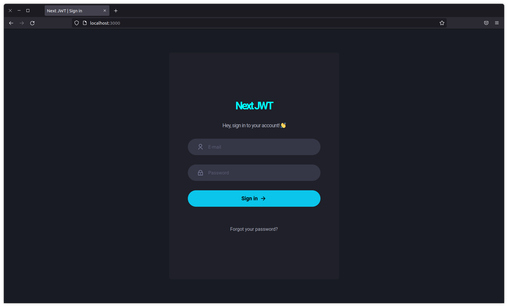

<div id="top" align="center">
  <div>
    
  </div>
  <h4 align="center">Next JWT | Nextjs integration with JWT (json web token)</h4>
</div>

## Resumo

  <ol>
    <li><a href="#visão-geral-do-projeto">Visão geral do projeto</a></li>
    <li><a href="#sobre-o-projeto">Sobre o projeto</a></li>
    <li><a href="#tecnologias-utilizadas">Tecnologias utilizadas</a></li>
    <li><a href="#instalação-e-utilização">Instalação e utilização</a></li>
    <li><a href="#licença">Licença</a></li>
    <li><a href="#agradecimentos">Agradecimentos</a></li>
  </ol>

## Visão geral do projeto

<div align="center">
      
      
      
</div>

## Sobre o projeto

Next JWT é um projeto que visa a implementação de funcionalidades de Json Web Token com o Next.js. Foram desenvolvidas 
nessa aplicação, sessões de usuários logados, com permissões, e com expiração de token. Para lidar com tokens expirados,
foi implementada a refresh token.

## Tecnologias utilizadas

As principais tecnologias utilizadas na construção deste projeto foram: 

* [Next.js](https://nextjs.org/)
* [Chakra UI](https://chakra-ui.com/guides/getting-started/nextjs-guide)
* [JWT](https://jwt.io/)
* [Axios](https://axios-http.com/docs/intro)
* [Nookies](https://github.com/maticzav/nookies)

## Instalação e utilização

Instruções de instalação do projeto em seu computador.

### Pré-requisitos

Clone este repositório utilizando o comando a seguir. Lembre-se, você deve possuir a CLI do git instalada em seu computador.

```sh
git clone https://github.com/ivanvinicius/nextjwt.git
```
Para que seja possível fazer o download das depêdencias do projeto, recomendamos a utilização de um package mananger:

* [Yarn (Recomendado para este projeto)](https://classic.yarnpkg.com/lang/en/docs/install/#debian-stable)
* [Npm](https://nodejs.org/en/)
  
### Instalação

1. Dentro da pasta do projeto, rode o comando ```yarn``` para fazendo o download da depêndencias.

2. Dentro da pasta do projeto, entre na pasta `backend` e rode o comando ```yarn``` para fazendo o download da depêndencias.

3. Para inciar a API, rode o comando ```yarn dev``` dentro da pasta `backend`.

4. Para inciar o projeto, rode o comando ```yarn dev``` dentro da pasta raiz.

## Licença

 O projeto ainda não contém nenhuma licença. ⚠️

## Agradecimentos

* [Rocketseat Education - Boosting People.](https://www.rocketseat.com.br/)
* [Diego Fernandes - Github Profile.](https://github.com/diego3g/)

<br/>
<h4 align="center"><a href="#top">Voltar ao Início</a></h4>

<p align="right">"Estabilidade não existe" - Flavio Augusto</p>